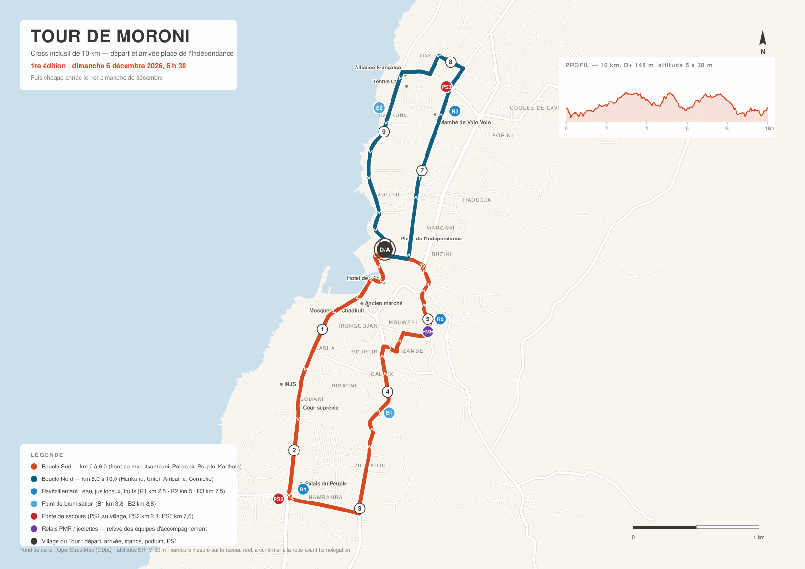

# TOUR DE MORONI

**Cross inclusif de 10 km — place de l'Indépendance, Moroni — le premier
dimanche de décembre.** Première édition : dimanche 6 décembre 2026.

> Un dimanche matin par an, Moroni ferme ses grands axes et court 10 kilomètres.
> Coureurs, familles, fauteuils, joëlettes, personnes déficientes visuelles :
> même départ, même parcours, même arche d'arrivée.

---

## Par où commencer

👉 **`dossier/README.md`** — l'index : il dit quoi lire avant quoi.
👉 **`dossier/MEMOIRE.md`** — l'état du projet et toutes les décisions prises.

| Dossier | Contenu |
|---|---|
| `dossier/` | Les cinq documents de référence : projet, parcours, budget, partenaires, mémoire |
| `carte/` | La carte du parcours, le tracé GeoJSON, et les trois scripts qui les fabriquent |

## La carte



`carte/carte-tour-de-moroni.svg` — format A3, s'imprime jusqu'à l'A0 sans perte.
S'ouvre dans n'importe quel navigateur.

## Le parcours en bref

Un **huit** de **10,02 km** autour de la place de l'Indépendance : boucle Sud de
6,05 km (front de mer, rue Itsambuni, Palais du Peuple, boulevard Karthala) puis
boucle Nord de 3,98 km (Hankunu, Union Africaine, rue de la Corniche). Dénivelé
positif 145 m, altitude de 5 à 38 m, 96 % du tracé sur des axes larges et
fermables — parce qu'une course où des fauteuils prennent le même départ que les
coureurs se juge d'abord à ses pentes.

Trois ravitaillements (km 2,5 · 5 · 7,5), deux points de brumisation, trois
postes de secours, un relais PMR au km 5, et 25 stands sur la place.

## Tout recalculer

```bash
cd carte
python3 extraire_osm.py        # rafraîchit les données OpenStreetMap et les altitudes
python3 calculer_parcours.py   # recalcule parcours, road-book et points de blocage
python3 carte.py               # redessine la carte
```

Aucune dépendance à installer : bibliothèque standard Python uniquement.

---

*Fond de carte : OpenStreetMap (ODbL) · altitudes : SRTM 30 m. L'attribution
OpenStreetMap doit rester visible sur toute carte publiée.*
